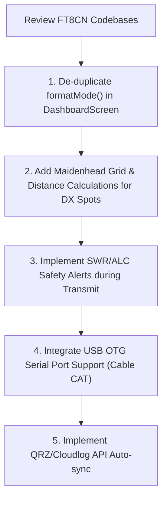

# Analysis & Comparison Report - FT8CN Features for FT81xCompanion

We have reviewed the **FT8CN** Android application codebase (specifically the `N0BOY/FT8CN` repository) to extract architectural design patterns, transceiver control interfaces, and functional enhancements that can enrich the **FT81xCompanion** app. 

---

## 1. Architectural Highlights of FT8CN

FT8CN is a fully featured portable FT8 client. It structures its transceiver interactions and digital signal processing (DSP) into modular packages:
*   `connector`: Abstracted communication layer supporting USB serial (cable), Bluetooth classic, and Network sockets.
*   `rigs`: Individual transceiver drivers extending a common `BaseRig` interface (including `Yaesu2Rig` for the FT-817/818).
*   `ft8transmit` & `ft8signal`: Core DSP layers performing audio tone generation and FFT-based decoding.
*   `maidenhead`: Coordinates-to-grid grid square calculator and great-circle distance/bearing calculators.
*   `spectrum`: Real-time waterfall UI painted on a Canvas.

---

## 2. Key Portability Opportunities for FT81xCompanion

By comparing the two repositories, we identified **five high-value features** that can be ported or implemented in FT81xCompanion:

### 2.1 USB OTG Serial Connection (`UsbSerialPort`)
*   **How FT8CN does it**: FT8CN implements `CableConnector.java` and `CableSerialPort.java` using serial port drivers to support USB-to-UART bridges (FTDI, CP2102, CH340, PL2303). It reads/writes raw data via Android's USB Host API using USB OTG cables.
*   **Value for FT81xCompanion**: Currently, FT81xCompanion only supports CAT control over **Bluetooth Classic** (SPP). Many amateur radio operators do not have Bluetooth modules installed on their FT-817/818 and prefer a direct USB-to-ACC CAT cable.
*   **Implementation Plan**:
    1.  Add `usb-serial-for-android` library to `app/build.gradle.kts`.
    2.  Create a `UsbCatPort.kt` class matching `CatPort.kt`'s public interface.
    3.  Expose connection options (Bluetooth vs. USB OTG) in `SettingsScreen.kt` and select the appropriate port in `MainViewModel`.

### 2.2 SWR & ALC Danger Alerts during Transmission
*   **How FT8CN does it**: During transmission, `Yaesu2Rig.java` reads the transceiver's TX status byte. It defines thresholds:
    *   `swr_817_alert_min = 6` (corresponds to VSWR $\ge$ 3.0)
    *   `alc_817_alert_max = 7` (corresponds to excessive audio levels)
    If these thresholds are crossed, the app displays a critical warning dialog or sounds an alarm.
*   **Value for FT81xCompanion**: The Yaesu FT-817/818 is a QRP rig, and operating it with high SWR or overdriven ALC can quickly damage its final amplifier transistors.
*   **Implementation Plan**:
    1.  Read the TX status byte from the CAT polling stream in `CatForegroundService.kt` during transmission.
    2.  Parse the SWR and ALC levels (packed inside the response).
    3.  If ALC exceeds safe values or SWR is high, trigger a haptic pulse, show a visual flashing banner in `DashboardScreen.kt`, and optionally force a PTT OFF safety shutdown.

### 2.3 Grid Square Distance & Bearing Calculator
*   **How FT8CN does it**: Integrates `MaidenheadGrid` helpers. When a station's grid (e.g. `FN31`) is decoded, it compares it to `myMaidenheadGrid` and calculates:
    *   The **great-circle distance** in kilometers.
    *   The **bearing (azimuth)** in degrees (e.g., 62° NE) to point directional antennas.
*   **Value for FT81xCompanion**: FT81xCompanion already tracks the phone's GPS position in the ViewModel. It can compute the local 6-digit Maidenhead grid, then compute distance/bearing for satellite orbits and DX Cluster spots in `LoggingScreen.kt`!
*   **Implementation Plan**:
    1.  Add a `MaidenheadLocator` utility class to convert `Location` (lat, lon) to a Maidenhead string.
    2.  For each DX spot collected from the DX Cluster, calculate and display the distance and bearing to the station relative to the user's current GPS location.

### 2.4 Automatic ADIF Log Syncing (QRZ / CloudLog)
*   **How FT8CN does it**: Provides integration settings (`enableCloudlog`, `enableQRZ`) to submit new contacts (QSOs) directly to online logging databases using their HTTP REST APIs.
*   **Value for FT81xCompanion**: Instead of forcing the user to manually export ADIF files and upload them later, contacts logged on the go via the **Logging** tab can be instantly uploaded to the operator's QRZ or Cloudlog cloud accounts.
*   **Implementation Plan**:
    1.  Add QRZ and Cloudlog API key fields to `SettingsScreen.kt`.
    2.  When `logQso` is invoked in `MainViewModel`, check if cloud sync is enabled, and launch an asynchronous HTTP POST request to upload the ADIF data.

### 2.5 Clean Up UI Duplicate Formatter
*   **How FT8CN does it**: Rig constants and formatters are centralized in Constants helper classes.
*   **Value for FT81xCompanion**: The `formatMode` function in `DashboardScreen.kt` is duplicated from the deleted ones.
*   **Implementation Plan**: Replace local `formatMode` in `DashboardScreen.kt` with the unified helper `CatProtocol.formatMode`.

---

## 3. Recommended Roadmap

