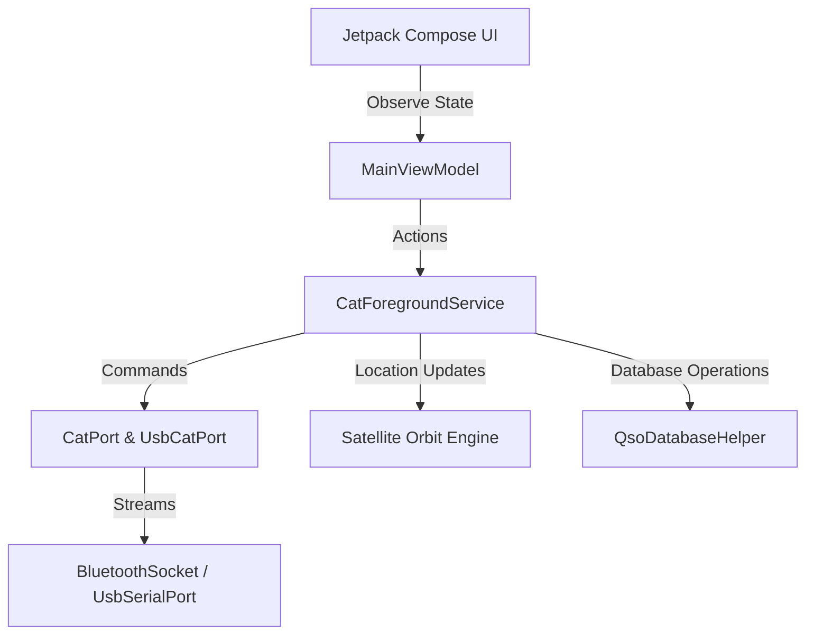

# Consolidated Implementation Plan - FT81xCompanion

This plan details the design and implementation of the **FT-81x Companion** application, containing the core architecture (Bluetooth CAT control, satellite tracking, QSO logging) alongside the **FT8CN-Inspired Features** and the **Smart-Scan** band scanner.

---

## 1. System Architecture

We implement the application using a clean, modern architecture with Jetpack Compose, Kotlin Coroutines, and Android's native Bluetooth/Location/USB Host APIs.



---

## 2. Core CAT & Connection Protocols (Bluetooth & USB)

### 2.1 Bluetooth CAT Control (`CatPort.kt` & `CatProtocol.kt`)
*   **RFCOMM Bluetooth Socket**: Manages connection to RFCOMM SPP UUID `00001101-0000-1000-8000-00805F9B34FB`.
*   **Sequential Writes**: Guarantees all 5-byte CAT command frames are written in a single write operation, preventing inter-byte gaps.
*   **Opcode Translation**: Translates high-level operations into Yaesu 5-byte commands and handles BCD (Binary Coded Decimal) conversions.

### 2.2 USB OTG Serial CAT control (`UsbCatPort.kt`) [NEW]
*   **Direct Serial Interface**: Leverages `usb-serial-for-android` to support direct serial CAT control over USB OTG cables.
*   **Supported Chips**: Supports standard USB-to-UART bridge chips (FTDI, CP2102, CH340, PL2303) found in commercial CAT cables.
*   **Serial Framing**: Configures Yaesu's default framing: 8 data bits, no parity, 2 stop bits (`8N2`).

### 2.3 Foreground Lifecycle & Watchdogs (`CatForegroundService.kt`)
*   **Foreground Service Notification**: Runs in a foreground service type `connectedDevice` with a persistent notification showing current frequency/mode/PTT.
*   **PTT Safety Timeout Watchdog**: Automatically unkeys (PTT OFF) after 3 minutes to prevent transmitter final damage.
*   **SWR Auto-Cutoff Watchdog [NEW]**: Polls and parses the TX status byte during transmission. If SWR is high for 2 consecutive ticks, it immediately shuts down transmission and updates the UI state flag `isSwrCutoffActive`.

---

## 3. Smart-Scan: Software-Defined Band Scanner

### 3.1 Overview
Since the Yaesu FT-817/818 does not have a native CAT command to scan, **Smart-Scan** implements scanning in software:
*   **VFO Sweeping**: Stepts VFO frequency sequentially from `Start Frequency` to `End Frequency` using user-defined step sizes (5 kHz to 100 kHz).
*   **Squelch Auto-Pause**: Queries the RX status byte on each step. If squelch is open (signal detected), it pauses stepping.
*   **Hang-Time Auto-Resume**: When squelch closes, it waits for a hang-time duration (1.5 seconds of silence) before resuming the sweep.
*   **Manual Override**: Any manual controls (VFO tuning, mode select, PTT, Morse) immediately stop the scanner.

---

## 4. Satellite Tracking & Doppler Compensation

### 4.1 SatelliteEngine.kt
*   **Orbit Propagation**: Parses standard Two-Line Element (TLE) Keplerian coordinates and propagates orbits native in Kotlin.
*   **Coordinates Mapping**: Computes Azimuth, Elevation, and Range relative to the observer's location.
*   **Doppler Compensation**: Updates VFO-A (downlink) and VFO-B (uplink) frequencies at a 1 Hz rate:
    $$\Delta f = f_0 \times \frac{v_{relative}}{c}$$

---

## 5. Database, QSO Logging & HTTPS API Syncing

### 5.1 SQLite Logbook (`QsoDatabaseHelper.kt`)
*   Manages local SQLite tables for QSOs and repeater presets. Exposes CRUD methods and handles exporting to ADIF format.

### 5.2 Secure Cloud Syncing (`MainViewModel.kt`) [NEW]
*   **Transport Security (HTTPS)**: Sends logged contacts to QRZ (`https://logbook.qrz.com/api`) and CloudLog APIs in background tasks using strict TLS-enforced HttpsURLConnections.
*   **Domain Validation**: Automatically upgrades cleartext `http://` URLs to `https://` to protect keys in transit.

### 5.3 DX Cluster Spotting (`DxClusterClient.kt`)
*   Connects to DX Cluster Telnet server and parses incoming spots.
*   **Distance/Bearing Enrichment [NEW]**: Converts coordinates to Maidenhead grids (e.g. `FN31ub`). Parses grids from DX spots comments and computes great-circle distance/bearing azimuths dynamically.

---

## 6. User Interface & Presentation

*   **DashboardScreen.kt**: DisplaysGlowing VFO, LED Arc S-Meter, VFO A/B swap, mode selectors, PTT controls, and the collapsible **Smart-Scanner** panel card.
*   **SatelliteScreen.kt**: Live radar sweep displaying uplink/downlink VFOs and orbit passes.
*   **LoggingScreen.kt**: Quick logs history list and DX Cluster spots table displaying distance/bearing inline (e.g., `1240 km @ 270° W`).
*   **SettingsScreen.kt**: Manages Bluetooth/USB selections, baud rates, and secure QRZ/CloudLog API keys text inputs with password visual masking.

---

## 7. Verification Plan

### Automated Tests
- Run Gradle debug compilation checks to verify clean builds:
  ```powershell
  ./gradlew compileDebugSources
  ```
- Run unit tests for orbit tracking math and ADIF exporters:
  ```powershell
  ./gradlew test
  ```

### Manual Verification
1.  **USB CAT Connectivity**: Connect direct CAT cable, verify connection state changes, and VFO updates.
2.  **SWR Safety Watchdog**: Verify high SWR simulation unkeys PTT instantly.
3.  **Smart-Scan**: Verify auto-pause dwells when squelch opens and resumes after signal drops.
4.  **HTTPS Logs Sync**: Verify that credentials are visually masked and uploads are executed securely.
