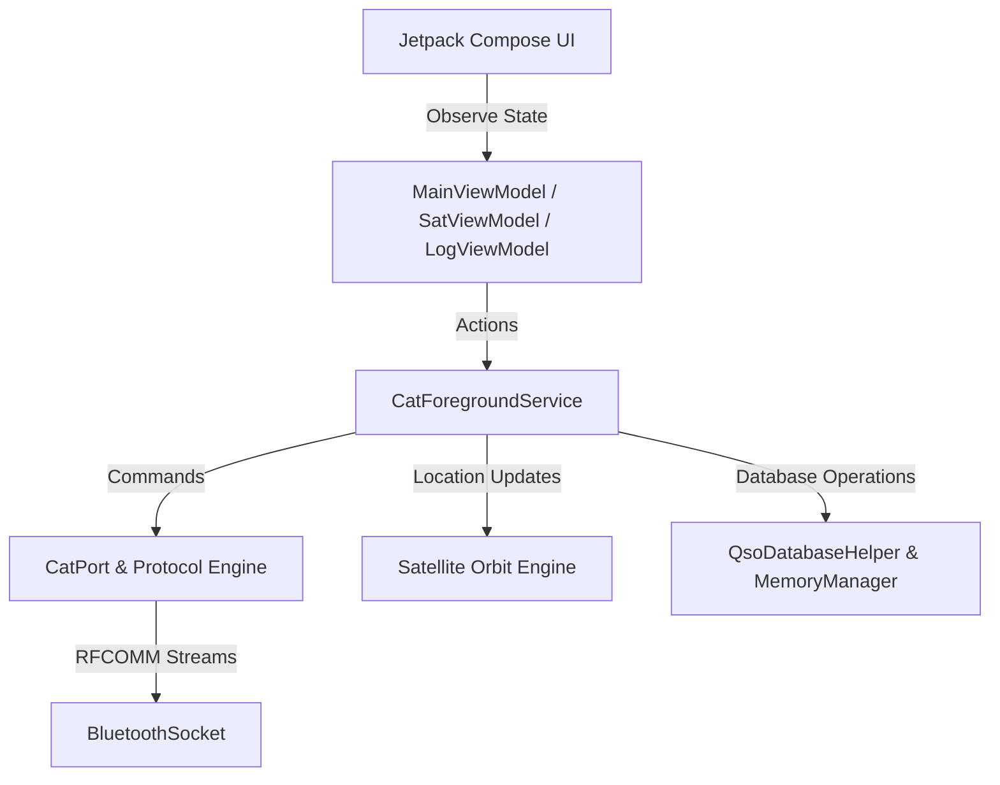

# Implementation Plan - Yaesu FT-818ND Android CAT Controller

This plan outlines the architecture, components, and user interface for the Android CAT Controller app (FT-81x Companion) to interface with the Yaesu FT-818ND transceiver via a Bluetooth-to-CAT adapter.

## User Review Required

> [!IMPORTANT]
> **Bluetooth Serial Link Layer & 8N2 Framing**
> The Yaesu FT-818ND requires **8N2** (8 data bits, no parity, 2 stop bits) UART framing. Since Bluetooth Classic RFCOMM (SPP) is a transparent byte pipe, the Android Bluetooth APIs do not control physical UART parameters (baud rate, stop bits, parity). These parameters must be configured directly on the CAT-to-Bluetooth adapter itself (usually via physical DIP switches, or AT commands when disconnected). 
> The app will provide baud rate settings in the UI to match the radio's setting and guide the user on configuring their adapter.

## Open Questions

> [!NOTE]
> **1. Satellite TLE Data Sources**
> For real-time Doppler shift compensation (REQ-SAT-02), we need satellite TLE (Two-Line Element) data. We plan to download this from CelesTrak. Is a fallback offline database of popular amateur satellites (e.g., ISS, SO-50, AO-91) acceptable when there is no internet access in the field?
> 
> **2. DX Cluster Server Defaults**
> For the DX Cluster feature (REQ-LOG-04), we will default to a popular public Telnet cluster (e.g., `dxc.radionet.pl` or `dxc.nc7j.com` on port 7373). Users can customize this in settings. Let us know if you have a preferred default server.

---

## Proposed Changes

We will implement the application using a clean, modern architecture using Jetpack Compose, Kotlin Coroutines, and Android's native Bluetooth/Location APIs.

### 1. Core Bluetooth & CAT Protocol Layer

We will create a robust, background-service-driven communication layer to ensure connection persistence, safety, and background execution.

#### [CatPort.kt](file:///c:/Users/peter/AndroidStudioProjects/FT81xCompanion/app/src/main/java/com/spacemishka/app/ft_81xcompanion/service/CatPort.kt)
- Manages the low-level `BluetoothSocket` connection to the RFCOMM SPP UUID `00001101-0000-1000-8000-00805F9B34FB`.
- Implements a thread-safe **command write queue** that guarantees all 5-byte CAT command frames are written in a single write operation, preventing inter-byte gaps that exceed the radio's 200 ms timeout.
- Implements a response reader that reads exactly 1 or 5 bytes based on the opcode and dispatches responses back to the caller using coroutine suspend channels.
- Implements a timeout watchdog (500 ms) and connection-drop auto-recovery.

#### [CatProtocol.kt](file:///c:/Users/peter/AndroidStudioProjects/FT81xCompanion/app/src/main/java/com/spacemishka/app/ft_81xcompanion/service/CatProtocol.kt)
- Translates high-level operations (e.g., `setFrequency(hz)`, `setMode(mode)`, `setPtt(on)`) into 5-byte CAT commands.
- Implements BCD (Binary Coded Decimal) encoding and decoding for frequencies and CTCSS tones.
- Decodes status bytes (RX Status `E7` and TX Status `F5`) into structured data models.

#### [CatForegroundService.kt](file:///c:/Users/peter/AndroidStudioProjects/FT81xCompanion/app/src/main/java/com/spacemishka/app/ft_81xcompanion/service/CatForegroundService.kt)
- An Android `ForegroundService` that keeps the Bluetooth connection alive when the app is backgrounded.
- Displays a persistent notification showing the current connected status, frequency, mode, and PTT state.
- Hosts the polling loop: polls frequency/mode (opcode `03`) and RX/TX status (opcodes `E7`/`F5`) every 500 ms (configurable).
- Implements the **PTT Safety Timeout** (REQ-PTT-02): automatically de-asserts PTT if keyed for longer than 3 minutes to prevent transmitter damage.
- Automatically releases PTT on service destruction or Bluetooth disconnect.

---

### 2. Satellite Tracking & Doppler Compensation

To ensure 100% self-contained compilation and avoid fragile third-party Maven dependencies, we will implement a lightweight, native Kotlin satellite tracking and orbit propagation engine.

#### [SatelliteEngine.kt](file:///c:/Users/peter/AndroidStudioProjects/FT81xCompanion/app/src/main/java/com/spacemishka/app/ft_81xcompanion/satellite/SatelliteEngine.kt)
- Parses standard SGP4 TLE (Two-Line Element) format.
- Implements Keplerian orbit propagation to compute satellite position (Latitude, Longitude, Altitude) at any UTC timestamp.
- Calculates Azimuth, Elevation, and Range from the observer's GPS coordinates (via Android's `FusedLocationProviderClient`).
- Computes Doppler shift for uplink and downlink frequencies at a 1 Hz refresh rate:
  $$\Delta f = f_0 \times \frac{v_{relative}}{c}$$
- Adjusts the radio's VFO-A (downlink) and VFO-B (uplink) frequencies dynamically during active passes.

---

### 3. Database & QSO Logging

We will build a lightweight local database using Android's native SQLite APIs for maximum speed and zero build-time annotation processing issues.

#### [QsoDatabaseHelper.kt](file:///c:/Users/peter/AndroidStudioProjects/FT81xCompanion/app/src/main/java/com/spacemishka/app/ft_81xcompanion/database/QsoDatabaseHelper.kt)
- Creates and manages the SQLite database for QSO logs and local repeater presets.
- Implements CRUD operations for QSOs: timestamp, callsign, frequency, mode, RST (sent/received), power, and notes.
- Exports logged QSOs to standard **ADIF (Amateur Data Interchange Format)** for import into LoTW, QRZ, or eQSL.

#### [DxClusterClient.kt](file:///c:/Users/peter/AndroidStudioProjects/FT81xCompanion/app/src/main/java/com/spacemishka/app/ft_81xcompanion/network/DxClusterClient.kt)
- Establishes a background TCP socket connection to a DX Cluster Telnet server.
- Parses incoming Telnet streams to extract DX spots (frequency, callsign, DX station, timestamp, comments).
- Exposes spots via a Kotlin `SharedFlow` to the UI, allowing one-tap frequency tuning (QSY).

---

### 4. User Interface & Presentation

We will build a premium, highly responsive user interface using Material 3, optimized for both portrait (phone) and landscape (field tablet) layouts.

#### [MainActivity.kt](file:///c:/Users/peter/AndroidStudioProjects/FT81xCompanion/app/src/main/java/com/spacemishka/app/ft_81xcompanion/MainActivity.kt)
- Configures edge-to-edge layout, handles permissions dynamically (`BLUETOOTH_CONNECT`, `BLUETOOTH_SCAN`, `ACCESS_FINE_LOCATION`).
- Binds to `CatForegroundService` and passes state to the Jetpack Compose screens.

#### [MainViewModel.kt](file:///c:/Users/peter/AndroidStudioProjects/FT81xCompanion/app/src/main/java/com/spacemishka/app/ft_81xcompanion/ui/MainViewModel.kt)
- Bridges the UI with the `CatForegroundService`.
- Exposes UI states: connection status, current frequency/mode, S-meter, PTT safety warnings, band-appropriate mode alerts.

#### [DashboardScreen.kt](file:///c:/Users/peter/AndroidStudioProjects/FT81xCompanion/app/src/main/java/com/spacemishka/app/ft_81xcompanion/ui/screens/DashboardScreen.kt)
- **Frequency Display**: Large, glowing, high-contrast digital readout (legible at arm's length, >= 24sp).
- **S-Meter**: Beautiful custom analog-style arc or multi-segmented LED bar displaying S0-S9, +10 to +30 dB, and SWR alerts during TX.
- **Tuning Controls**: Interactive rotary-dial tuning wheel, quick-step buttons, and a numeric keyboard modal for direct entry.
- **PTT Button**: Prominent, high-tactility red button with haptic feedback on press and release. Features active safety timeout countdown.
- **Band Stack & Presets**: Rapid HF/VHF/UHF band switching (160m to 70cm) with internal VFO memory.

#### [SatelliteScreen.kt](file:///c:/Users/peter/AndroidStudioProjects/FT81xCompanion/app/src/main/java/com/spacemishka/app/ft_81xcompanion/ui/screens/SatelliteScreen.kt)
- Dual-VFO view showing uplink and downlink simultaneously.
- Live pass details: Azimuth/Elevation radar view, AOS/LOS countdown, and real-time Doppler shift indicators.

#### [LoggingScreen.kt](file:///c:/Users/peter/AndroidStudioProjects/FT81xCompanion/app/src/main/java/com/spacemishka/app/ft_81xcompanion/ui/screens/LoggingScreen.kt)
- Quick-log form with auto-filled timestamp, frequency, and mode.
- Interactive DX spots table with tap-to-QSY.
- ADIF export panel.

#### [SettingsScreen.kt](file:///c:/Users/peter/AndroidStudioProjects/FT81xCompanion/app/src/main/java/com/spacemishka/app/ft_81xcompanion/ui/screens/SettingsScreen.kt)
- Bluetooth pairing and device selection.
- Baud rate selector, polling speed, and PTT safety limit.
- EEPROM write capabilities are completely excluded for absolute radio safety.

---

## Verification Plan

### Automated Tests
We will add unit tests to verify BCD conversions, TLE parsing, and Doppler calculations.
- `.\gradlew test` to run all local JVM unit tests.

### Manual Verification
1. **Bluetooth Connection & Parsing**: Verify RFCOMM socket creation, connection state transitions, and robust polling response decoding.
2. **PTT & Safety Timeout**: Verify that holding the PTT button asserts PTT, releasing it de-asserts it, and holding it beyond 3 minutes automatically triggers PTT OFF.
3. **UI Layouts**: Test both portrait (one-handed phone use) and landscape (tablet dashboard layout) using Android Compose preview and emulator execution.
