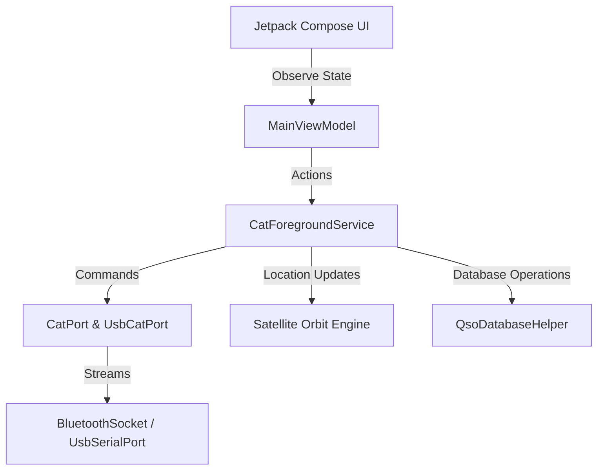

# FT81xCompanion 📻✨

**FT81xCompanion** is a premium, self-contained Android companion application for the legendary **Yaesu FT-817 & FT-818** QRP transceivers. Designed for portability, field operation (SOTA, POTA), and satellite tracking, it bridges the gap between classic hardware and modern mobile design.

This app is built using **Jetpack Compose**, **Kotlin Coroutines**, and **Kotlin StateFlows** — focusing on thread-safety, security, and a beautiful glowing dark-mode UI.

---

## 🌟 Key Features

### 🔌 1. Dual CAT Connectivity
*   **Bluetooth SPP Mode**: Direct wireless control using standard Bluetooth serial adapters.
*   **USB OTG Mode**: Plug-and-play serial connection using OTG cables (supports FTDI, CP2102, CH340, PL2303 UART bridge chips) at selectable baud rates (e.g. 4800, 9600, 38400 bps).

### 🛰️ 2. Native Satellite Pass Tracker & Doppler Tuning
*   **100% Offline Keplerian Propagator**: Computes satellite position (Lat, Lon, Alt) and pass details (Azimuth, Elevation, Range) offline using standard Two-Line Element (TLE) datasets.
*   **Real-Time Doppler Correction**: Adjusts the transceiver's downlink (VFO-A) and uplink (VFO-B) frequencies at a $1\text{ Hz}$ update rate using the formula:
    $$\Delta f = f_0 \times \frac{v_{\text{relative}}}{c}$$

### 🔍 3. Smart-Scan Band Scanner
*   **Squelch-Aware Stepping**: Sweeps VFO frequencies sequentially over a configurable MHz range and step size (5 kHz to 100 kHz).
*   **Squelch Threshold Filter**: Configurable minimum S-Meter threshold (S0 to S9). The scanner only pauses if squelch opens and signal strength matches or exceeds the selected level, preventing stops on weak background static.
*   **Configurable Dwell Speed**: Supports dwell rates from 50 ms (Fast) to 1.0 s, combined with a minimized 20 ms frequency lock settle delay for optimized, rapid band sweeps.
*   **1.5s Hang-Time Delay**: Wait for a short duration after a signal fades before resuming the sweep, preventing transmission fragmentation.

### 🛡️ 4. QRP Transceiver Safety Guard
*   **SWR Watchdog Cutoff**: During PTT transmission, the app monitors the transceiver's SWR status. If high VSWR is detected for 2 consecutive ticks, it triggers a safety auto-cutoff, immediately unkeying (PTT OFF) and aborting Morse code to protect the radio's power amplifier (PA).
*   **PTT Timeout Watchdog**: Automatically unkeys PTT if keyed continuously for more than 3 minutes to prevent overheating.

### ✍️ 5. CW Morse Auto-Keyer & Farnsworth Spacing
*   **Software Audio & ACC PTT Keying**: Supports simultaneous sidetone audio play and radio keying.
*   **ARRL Farnsworth Spacing**: Stretches inter-character and inter-word delays using the mathematical Farnsworth algorithm, maintaining clean character speeds (e.g. 18 WPM) while reducing overall speed (e.g. 12 WPM) for practice:
    *   $T_a = 1200 / W_f$ (Character speed unit)
    *   $T_b = 1200 / W$ (Target overall speed unit)
    *   $T_s = (60000 / W - 31 \times T_a) / 19$ (Stretched unit time)

### 🗺️ 6. DX Cluster & Maidenhead Calculations
*   **Maidenhead Locator**: Conversions from GPS coordinates to 6-digit grid locators (e.g. `FN31ub`).
*   **Enriched Spots**: Parses locator grids from DX Cluster comments and calculates the Great-Circle distance (km) and direction bearing (degrees + cardinal point) from your station, displayed inline in green under spots.

### ☁️ 7. Secure Logbook Uploads (QRZ & CloudLog)
*   **Strict HTTPS transport**: Auto-upgrades cleartext URLs to secure `https://` to ensure API keys are protected in transit.
*   **Credential Masking**: Excludes API credentials from Logcat output and utilizes password visual transformations in input forms.

---

## 🛠️ Architecture Overview

The app utilizes a decoupled architecture where the UI observes the state flow model and sends requests to the persistent background service:



---

## 🚀 Getting Started

### Prerequisites
*   Android device running API 26 (Android 8.0 Oreo) or higher.
*   A Yaesu FT-817 / FT-818 transceiver.
*   A compatible CAT adapter cable (Bluetooth SPP or USB OTG serial cable).

### Compile & Build
To build the debug APK from the command line, run:
```powershell
./gradlew assembleDebug
```

Verify Kotlin compilation and code guidelines:
```powershell
./gradlew compileDebugSources
```

To run the unit tests:
```powershell
./gradlew test
```

---

## 📜 Documentation

Detailed planning, architecture, and verification documents are located in the [Documentation/](file:///C:/Users/peter/AndroidStudioProjects/FT81xCompanion/Documentation/) folder:
*   [Documentation/implementation_plan.md](file:///C:/Users/peter/AndroidStudioProjects/FT81xCompanion/Documentation/implementation_plan.md) - Consolidated design configurations.
*   [Documentation/walkthrough.md](file:///C:/Users/peter/AndroidStudioProjects/FT81xCompanion/Documentation/walkthrough.md) - Summary of implemented features.
*   [Documentation/code_review.md](file:///C:/Users/peter/AndroidStudioProjects/FT81xCompanion/Documentation/code_review.md) - Thread-safety and timing audit reports.
*   [Documentation/ft8cn_comparison_analysis.md](file:///C:/Users/peter/AndroidStudioProjects/FT81xCompanion/Documentation/ft8cn_comparison_analysis.md) - Analysis of FT8CN integrations.

---

## ⚖️ License & Disclaimers

Operate responsibly! Keep your transmitter matched and monitor VSWR when using remote PTT control. The safety features (SWR Watchdog) are designed to assist but do not replace careful station control. Happy QRP operating! 🏕️⚡
